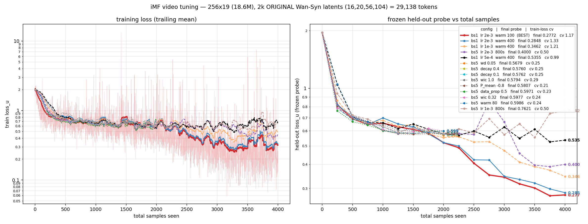

# Target

- Move improved Mean Flow method to video models

# TO BE Improved and Ascertained

- Parameter Tune

- Wan2.1 ?

- Align Parameters/optimizers for model comparisons

- Examine the efficiency of iMF and see if we can further improve this arch

- in self-attention, $\sqrt{d}$ is always not needed. Since you can put it in initialization

# Latest Loss Curve

# Done

- JVP MLA Kernel

- Moonlight (scaled + weight decay version of muon)
